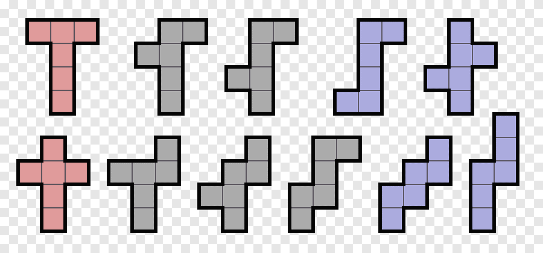

<h1 align="center"> poly-ominoes </h1>


<h1 align="center"> Usage: </h1>

To run the code: first, clone the repository, move into the code folder, and then run main.py

```bash
git clone https://github.com/FlynnOwen/poly-ominoes.git
cd code
python3 main.py
```

1. You will be prompted for the order of polyomino (N) - this must be an integer value
2. You will then be asked if you'd like to print all polyominoes of this order (y/N)


<h1 align="center"> Methods </h1>

<h2 align="center"> Overview </h2>

I have decided to use a recursive solution. Given all one-sided polyominoes of order n - 1, we can construct all one-sided polyominoes of order n. We do this by keeping a unique cache (a set, initialised as empty) of all one-sided polyominoes of order n, and for each polyomino of order n-1, we add a single tile in any free adjacent position to each existing tile. We then rotate this new one-sided polyomino by 90 degrees anti-clockwise and check it against our cache. If it is in the cache, we un-rotate the polyomino and move onto placing a different tile. If it isn't in the cache, we repeat this process until we have rotated it a full 360 degrees. If none of the rotations of this polyomino are in the cache, it is added to the cache. 

This is then repeated for each possible free, adjacent tile, for each one-sided polyomino of order n-1. Once we are completed, we re-initialise the cache, and set n = n + 1, using our old cache as our set of one-sided polyominoes of order n - 1.


<h2 align="center"> How this code deals with translation and rotation: </h2>
We can view a one-sided polyomino as a tiling within a discrete space. 

In this code, divide this space up into 4 qudrants, with x values increasing when moving right across this space, and y values increasing as we move down this space. 

We enforce that a polyomino is in the most top, left possible place in this bottom right quadrant (e.g, it's furthest left tile will be at location x=0 and it's top tile will be at location y=0. Given this poly-omino, we can place a tile at any point adjacent to where any of it's current tiles sit. If it happens that the placed tile is in another quadrant (e.g it's x or y value is negative) the poly-omino is translated to be in it's enforced position (as top-left as possible in this bottom-rght quadrant).

Each time we place a tile, we rotate the polyomino 90 degrees anti clockwise in place (by rotating it along the y-axis, and then translating downwards it to be in the usual enforced position). 

The combination of rotating 90 degrees anti-clockwise along the y-axis and translating downwards to the enforced position acts as an 'on the spot' 90 degree rotation.

<h2 align="center"> Memory and speed optimizations </h2>
By using a generator to keep track of all polyominoes of order n - 1 (used to calulate polyominoes of order n) we reduce memory by storing all polyominoes of order 1 -> n-1. Also by keeping a hashset of all current one-sided polyominoes of order n and not caching all possible translations / rotations of any given free-polyomino of order n, we are minimizing memory consumption.

We could parallelize this algorithm reasonably easily. By viewing the hashset of polyominoes of order n as a global (shared state / mutex) variable, we could compute all tile placements / rotations / translations given polyominoes of order n-1 in parallel. 
